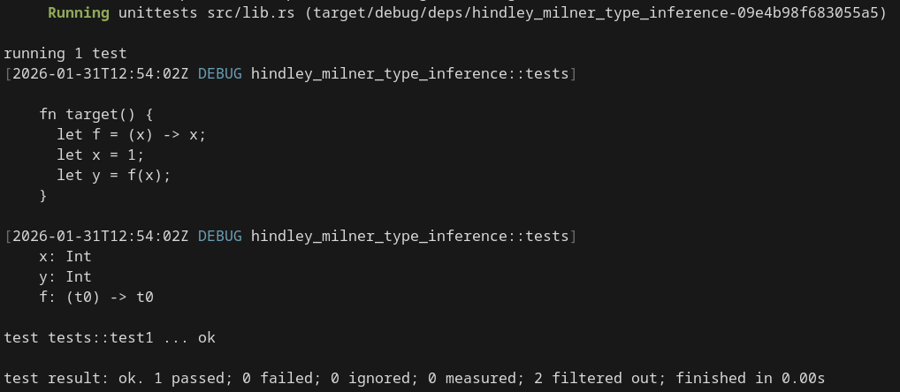
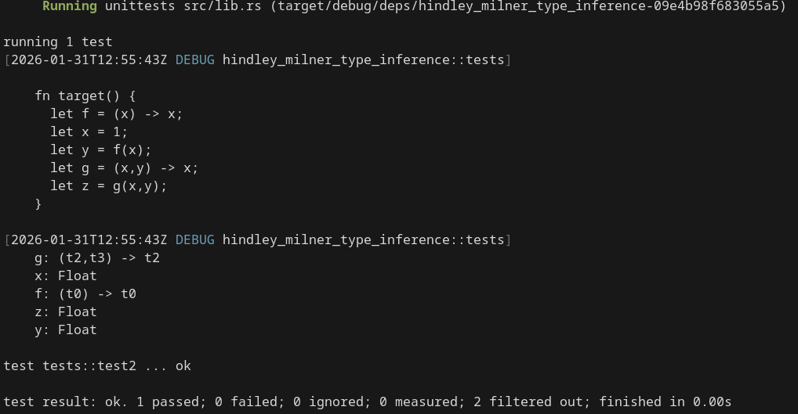
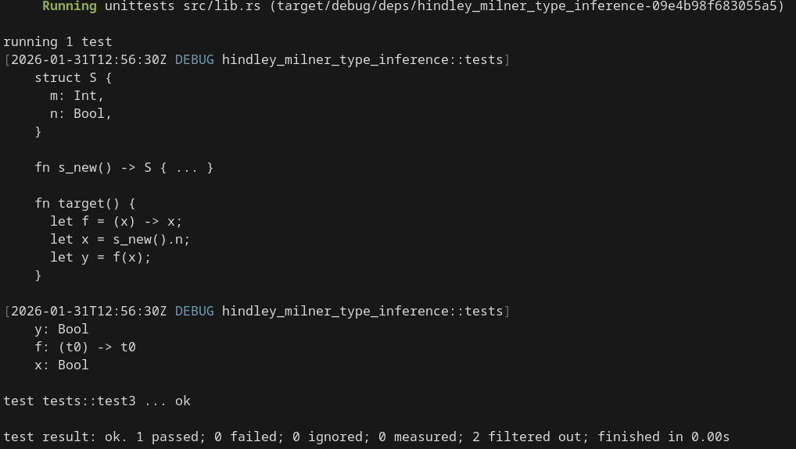

# みなさんﾊﾟｿｶﾀしてますか〜？私はパソ型してます。

## \~Hindley-Milnerの理論をベースに型推論を実装する\~

---

## とりあえず、自己紹介


こんにちは。
情報科学類2年のゃー(reversed_R)です。

Twitter: [@reversed_R](https://x.com/reversed_R)
GitHub: [reversed-R](https://github.com/reversed-R)
HP: [https://reversed-r.dev](https://reversed-r.dev)

---

## みなさんﾊﾟｿｶﾀしてますか？

---

## みなさんﾊﾟｿｶﾀしてますか？

-> 私はパソ型してます。

---

## パソ型??????

コンパイラを書いており、強力な型システムというのがあると良いよね、に。

-> Hindley-Milnerの型システムをベースに型推論を実装することに。

---

## 型推論とは

### 型検査

伝統的に静的型付け言語において、型は明示的に書かれてきた。

---

- Cの例

```c
int main(int argc, char **argv) {
  /*
  ココ
  |
  vvv */
  int x = 0;

  return 0;
}
```

---

- Javaの例

```java
public static void main(String[] args) {
  /*
  ココ                         ココも
  |                            |
  vvvvvvvvvvvv                 vvvvvvvvvvvvvvvvv */
  List<String> arrayList = new ArrayList<String>();
}
```

---

でも型をわざわざ書くのはダルい!!

いくらなんでもわかりきっている部分に書くのは冗長。

---

### 一方その頃、関数型言語では...

<style scoped>
.grid-container {
  display: grid;
  grid-template-columns: auto 1fr;
}

.comment-container {
  padding: 1em;
}
</style>

多相型付きラムダ計算をしたいMilnerおじさんが型推論を発見(なおそれ以前にHindleyも見つけていた)、
(Standard MLやOCamlなどの祖である)MLを作り、多くの関数型言語に取り入れられていた。

<div class="grid-container">
  
  <div class="comment-container">
    <p> { 型、推論したすぎ!]</p>
  </div>
</div>

---

- Standard MLの例

```ml
(* 引数の型すら書いてない
              |
              v *)
fun factorial x =
  if x = 0 then 1 else x * factorial (x-1)
(*              ^      ^^^^^^^^^^^^^^^^^^^
                |      |
            戻り値の型を推論可能
 *)
```

---

グローバルな関数の引数や戻り値の型を書かないのはやり過ぎにしても、

- Rustの例

```rs
let x: i32 = 0;
//     ^^^ 書いている例
let x = 0;
//   ^
//   |
// 書かなくても推論される
```

こういうシンプルな例は純粋に便利。

---

### 注意

動的型付け(いわゆるダックタイピング)とは違う。
明示的に型が書かれないことがあるだけでコンパイル時に推論の結果決定されている。
型の文脈内で方程式を解いているのに近い。
型が合わない場合というのは方程式の解がない場合に当たる。つまり検査も包含されているわけで型検査の拡張と言える。

---

## Hindley-Milnerの理論やっていきましょう

### 以下定義...

#### 式(expression)

$$
\begin{aligned}
  e &= x &\text{(variable)} \\
    &| \quad e_{1} \, e_{2} &\text{(application)} \\
    &| \quad \lambda x. e &\text{(abstraction)} \\
    &| \quad \text{let} \, x \, = \, e_{1} \, \text{in} \, e_{2}
\end{aligned}
$$

---

#### 型

$$
\begin{aligned}
  \text{mono} \\
  \tau &= \alpha &\text{(variable)} \\
    &| \quad C \tau ... \tau &\text{(application)} \\
  \text{poly} \\
  \sigma &= \tau \\
    &| \quad \forall \alpha . \sigma &\text{(quantifier)}
\end{aligned}
$$

$\sigma$は型スキーム。つまり、ジェネリクス型(例: `Vec<T>`)。

---

#### 型文脈, 型導出

$$
\begin{aligned}
  \text{context} \\
  \Gamma &= \epsilon &\text{(empty)} \\
    &| \quad \Gamma, x: \sigma \\
  \text{typing} \\
  &= \Gamma \vdash e: \sigma
\end{aligned}
$$

---

### 型導出規則

- variable

$$
\frac{x: \sigma \in \Gamma}{\Gamma \vdash x: \sigma}
$$

- application

$$
\frac{\Gamma \vdash e_{0}: \tau \rarr \tau' \qquad \Gamma \vdash e_{1}: \tau}{\Gamma \vdash e_{0} \, e_{1}: \tau'}
$$

---

- abstraction

$$
\frac{\Gamma, x: \tau \vdash e: \tau'}{\Gamma \vdash \lambda x . e: \tau \rarr \tau'}
$$

- let

$$
\frac{\Gamma \vdash e_{0}: \sigma \qquad \Gamma, x: \sigma \vdash e_{1}: \tau}{\Gamma \vdash \text{let} \, x \, = \, e_{0} \, \text{in} \, e_{1}: \tau}
$$

---

<style scoped>
.copyright {
  text-align: right;
  font-size: 10px;
}
</style>


<p class="copyright">©若木民喜/小学館</p>

---

### んで、どうしろと?

-> これをどう実装するかという話で **_Algorithm W_** というものがあります(それ以外もあるが、Milnerが提唱したのはこれ)。

---

### Algorithm W

<style scoped>
.paper {
  text-align: right;
  font-size: 20px;
}
</style>


<p class="paper">Damas & Milner, 1982</p>

---

基本的には2つの道具によって実現される。

- substituition(代入)
  型変数$\alpha$から型$\tau$へのマップ
  `HashMap<TyVar, Ty>`

- unification(単一化)
  型の組$(\tau_{1}, \tau_{2})$があるとき、両者が一致するsubstituitionを計算する。

---

$$
\begin{aligned}
  &unify(\tau_{1}, \tau_{2}): \\
  &\quad \text{if} \quad \text{どちらかが型変数}: \\
  &\quad \quad \text{もう片方の型を}substituition \\
  &\quad \text{else if} \quad \text{両者が} C\tau_{1}' ... \tau_{n}', \quad  C\tau_{1}'' ... \tau_{n}'' : \\
  &\quad \quad \forall i. \quad unify(\tau_{i}', \tau_{i}'') \\
  &\quad \text{else}: \\
  &\quad \quad \text{エラー}
\end{aligned}
$$

---

- Rustでの実装

```rs
fn unify(&mut self, t1: Ty, t2: Ty) -> TyResult<()> {
    let t1 = self.apply(t1);
    let t2 = self.apply(t2);

    match (t1.clone(), t2.clone()) {
        (Ty::Var(v), t) | (t, Ty::Var(v)) => {
            let t = self.apply(t);
            if t == Ty::Var(v.clone()) {
                Ok(())
            } else if occurs(&v, &t) {
                Err(TyError::OccursCheckFailed(v, t))
            } else {
                self.substitutions.insert(v, t);

                Ok(())
            }
        }
        (Ty::Int, Ty::Int) | (Ty::Float, Ty::Float) | (Ty::Bool, Ty::Bool) => Ok(()),

        (Ty::Fn(f1), Ty::Fn(f2)) => {
            if f1.args.len() != f2.args.len() {
                Err(TyError::FnArgLenMismatched(f1, f2))
            } else {
                for (a1, a2) in f1.args.into_iter().zip(f2.args.into_iter()) {
                    self.unify(a1, a2)?;
                }

                self.unify(*f1.ret, *f2.ret)?;

                Ok(())
            }
        }
        _ => Err(TyError::TypeConfliced(t1, t2)),
    }
}
```

---

- Algorithm Wのメインの推論部分

```rs
fn infer_expr(&mut self, env: &mut TyEnv, expr: &Expr) -> TyResult<Ty> {
    match expr {
        Expr::Literal(Literal::Integer(_)) => Ok(Ty::Int),
        Expr::Literal(Literal::Float(_)) => Ok(Ty::Float),
        Expr::Literal(Literal::Bool(_)) => Ok(Ty::Bool),

        Expr::Variable(v) => {
            let scheme = env.map.get(v).ok_or(TyError::VariableNotFound(v.clone()))?;
            Ok(self.instantiate(scheme))
        }
        // ... 次ページ
    }
}
```

---

```rs
Expr::Lambda(l) => {
    let mut local_env = env.clone();

    let args: Vec<Ty> = l
        .args
        .iter()
        .map(|a| {
            let tv = self.fresh();
            local_env.map.insert(
                a.clone(),
                Scheme {
                    vars: vec![],
                    typ: tv.clone(),
                },
            );
            tv
        })
        .collect();

    let body = self.infer_expr(&mut local_env, &l.ret)?;

    Ok(Ty::Fn(FnTy {
        args,
        ret: Box::new(body),
    }))
}
```

---

```rs
Expr::Call(c) => {
    let f = self.infer_expr(env, &Expr::Variable(c.f.clone()))?;
    let args = c
        .args
        .iter()
        .map(|a| self.infer_expr(env, a))
        .collect::<Result<_, _>>()?;

    let ret = self.fresh();
    self.unify(
        f,
        Ty::Fn(FnTy {
            args,
            ret: Box::new(ret.clone()),
        }),
    )?;

    Ok(ret)
}
```

---

## デモ

今回作ったHindley-Milnerベースの型推論器で次の構文例の推論をしていきます。

---

1.

```rs
let f = (x) -> x;
let x = 1;
let y = f(x);
```

$$
\begin{aligned}
  f&: \forall \alpha . \alpha \rarr \alpha \\
  x&: Int \\
  y&: Int
\end{aligned}
$$

と付けば正しい。

---

2.

```rs
let f = (x) -> x;
let x = 1.0;
let y = f(x);
let g = (x, y) -> x;
let z = g(x, y);
```

---

$$
\begin{aligned}
  f&: \forall \alpha . \alpha \rarr \alpha \\
  x&: Float \\
  y&: Float \\
  g&: \forall \alpha \beta . \alpha \rarr \beta \rarr \alpha \\
  z&: Float
\end{aligned}
$$

と付けば正しい。

---



---



---

**やった〜、できました〜**

---

## 今後の展望

- 実用的な言語にしたい
  - グローバルな関数には明示的に型を書くものとする
  - ジェネリクスの導入
    - まあ元々多相があるのでほぼ出来ているという話はある
  - 構造体などの導入
    - メンバアクセス式に対応
  - メソッドの導入
  - 型クラスやトレイトに該当する概念の導入
    - trait solverが必要。RustのChalkなど

---

- グローバルな関数と構造体を含む例

```rs
struct S {
  m: Int,
  n: Bool,
}

fn s_new() -> S {
  S {
    m: 0,
    n: false,
  }
}

fn target() {
  let f = (x) -> x;
  let x = s_new().m;
  let y = f(x);
}
```

---

$$
\begin{aligned}
  f&: \forall \alpha . \alpha \rarr \alpha \\
  x&: Bool \\
  y&: Bool
\end{aligned}
$$

と付けば正しい。

---



---

## 参考

- Principal type-schemes for functional programs (Luis Damas\* and Robin Milner, 1982)
- [「型推論器の実装①　Hindley-Milner型システム」ksrk (Zenn)](https://zenn.dev/ksrk/articles/5e4a6858c43d6f)
- [「JEP 286 を調べていたはずなのにいつのまにか Kotlin で Hindley-Milner 型推論を実装していた」 reki2000 (Qiita)](https://qiita.com/reki2000/items/b7f26e65930519295355)

---

## おわり

みんなもパソ型しよう!!

リポジトリはこちら
-> [https://github.com/reversed-R/hindley-milner-type-inference/](https://github.com/reversed-R/hindley-milner-type-inference/)
